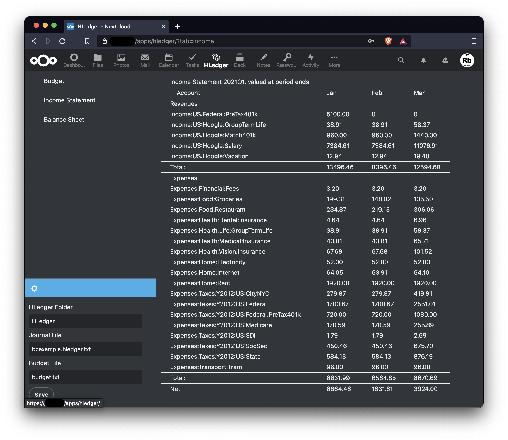
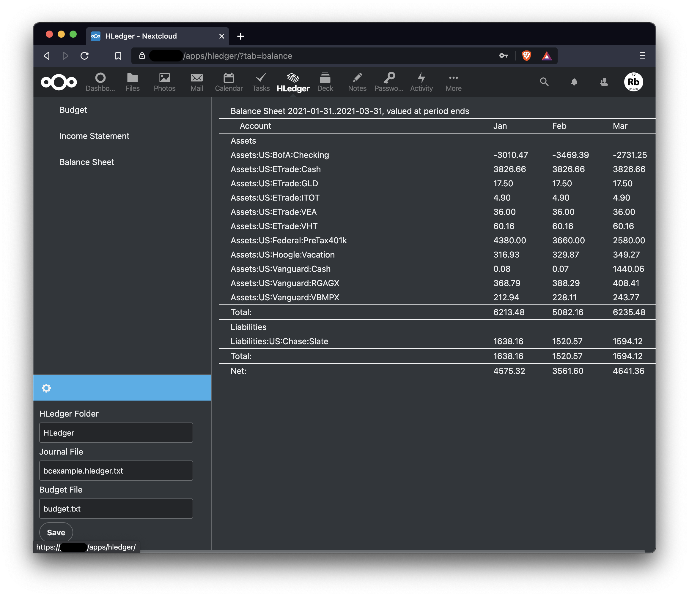
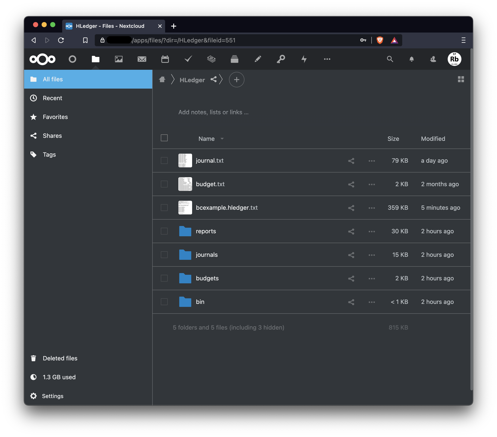

# HLedger Plain Text Accounting on Nextcloud

[HLedger](https://hledger.org/) is cross-platform accounting software for both power users and folks new to accounting. It's good for tracking money, time, investments, cryptocurrencies, inventory and more.

[Plain Text Accounting](https://plaintextaccounting.org/) means doing accounting with plain text data formats and scriptable software.

## Why Plain Text Accounting on Nextcloud?

Rather than storing financial data in a rigid or proprietary database, you can just record all your transactions as text and let the reporting tools do the hard work.

As a file storage system with desktop sync and mobile access, Nextcloud is a natural fit for plain text accounting. It provides a safe, private, easily accessible place to store your financial data. It provides security, online editing, multi-user, collaboration, desktop sync and mobile device access without compromising privacy or forcing you to trust a company as you must do with tools like Quicken, Mint, YNAB, etc...

## Features

* Add/edit transactions through the web
* [Sharing](https://docs.nextcloud.com/server/latest/user_manual/en/files/sharing.html) and [collaborative editing](https://github.com/nextcloud/text#readme)
* [Multiple currencies](https://hledger.org/multicurrency-tutorial.html) including [stocks and cryptocurrency](https://hledger.org/investments.html)
* [Budgeting and forecasting](https://hledger.org/budgeting.html)
* [Version control included in Nextcloud](https://docs.nextcloud.com/server/latest/user_manual/en/files/version_control.html), [Git compatible](https://hledger.org/track-changes-with-version-control.html)
* [Desktop and mobile sync](https://docs.nextcloud.com/server/latest/user_manual/en/files/desktop_mobile_sync.html)
* Everything needed for [double entry accounting](https://hledger.org/accounting.html)

## Screenshots





## Demo Site

Want to see it in action without setting up Nextcloud? Create a free account on the demo site.

[https://demo.hledger.cloud](https://demo.hledger.cloud/)

**Warning:** The demo site is only for demonstration. You may not use it for your own accounting. There is no privacy or security on the demo site, either explicit or implied. You can and will lose your files at any time. Do not enter your private financial information on the demo site.

Do try it and provide feedback on [Nextcloud](https://help.nextcloud.com/c/apps/26) and [Github](https://github.com/37Rb/nextcloud-hledger/issues)!!!

## Requirements

This app uses [shell_exec](https://www.php.net/manual/en/function.shell-exec.php) and therefore shell_exec must be enabled in your server.

## Build & Develop

Install backend dependencies.
```
$ composer install
```

Install frontend dependencies.
```
$ npm install
```

Build frontend assets for development.
```
$ npm run-script dev
```
Watch and build frontend assets as files change.
```
$ npm run-script watch
```

Build frontend assets for production.
```
$ npm run-script build
```

## Contact Us

If you have questions or would like to participate, let's talk!

* [Github issues](https://github.com/37Rb/nextcloud-hledger/issues)
* [Nextcloud user help](https://help.nextcloud.com/c/apps/26)
* [Nextcloud dev help](https://help.nextcloud.com/c/dev/app-dev/24)
* [HLedger mailing list](https://groups.google.com/g/hledger)
